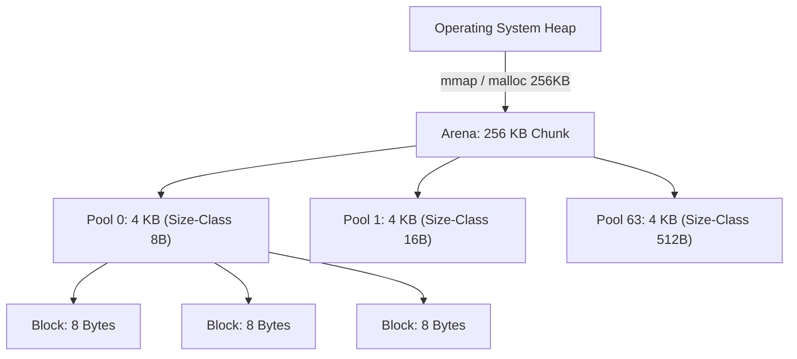
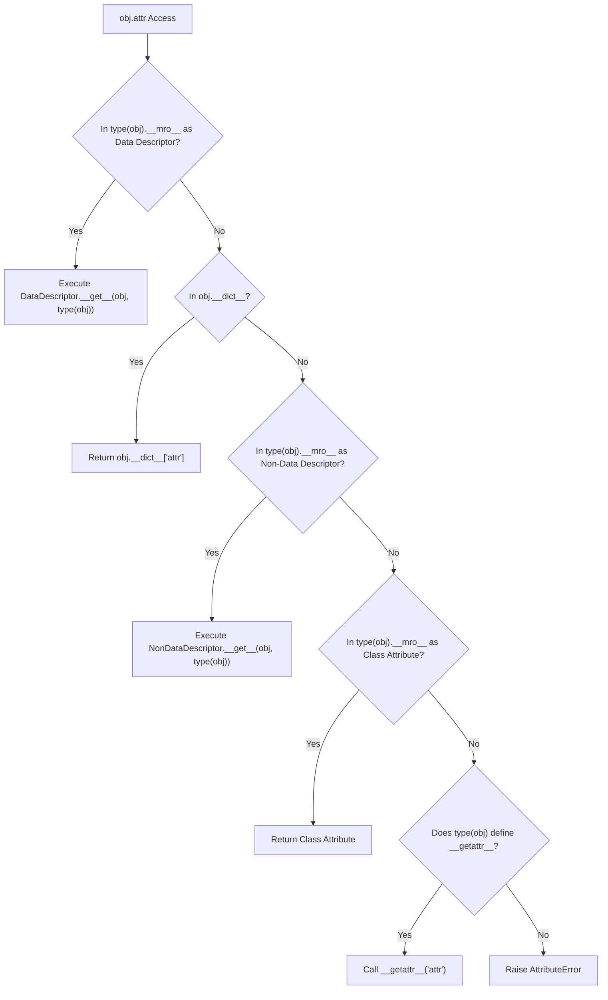
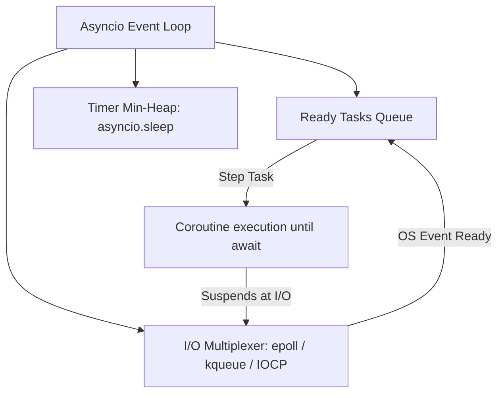

# Learn Python: The Complete Beginner-to-Expert Masterclass

[](https://github.com/manthanank/learn-python/actions/workflows/ci.yml)
[](https://github.com/manthanank/learn-python/actions/workflows/docker.yml)
[](https://github.com/manthanank/learn-python/actions/workflows/releases.yml)
[](https://www.python.org/)
[](LICENSE)
[](https://github.com/astral-sh/ruff)

An exhaustive, authoritative **beginner-to-expert guide** and interactive platform for Python and CPython systems architecture. This curriculum begins with zero-prerequisite syntax, control flow, functions, and OOP foundations, advances into intermediate runtime mechanics and PEP 659 adaptive bytecode execution, dives into memory internals (PyMalloc, refcounting, generational GC) and descriptors, explores advanced concurrency (the GIL, PEP 703 free-threaded 3.13, Asyncio TaskGroups), and culminates in enterprise ASGI system design, profiling, and staff-level engineering.

---

## Pedagogical Roadmap: Beginner to Expert

```text
+-----------------------------------------------------------------------------------------------+
|                               THE PYTHON LEARNING JOURNEY                                     |
+-------------------+-------------------+-----------------------+-------------------------------+
| STAGE 1           | STAGE 2           | STAGE 3               | STAGE 4 & 5                   |
| Absolute Beginner | Intermediate Core | Advanced Internals    | Expert Concurrency & Staff    |
+-------------------+-------------------+-----------------------+-------------------------------+
| • What is Python? | • Scope & LEGB    | • PyObject Layout     | • GIL & PEP 703 Free-Threaded |
| • Dynamic/Strong  | • CPython VM & AST| • PyMalloc Arenas     | • Asyncio Event Loop & Tasks  |
| • Types & Strings | • Bytecode & dis  | • Tracing GC & Cycles | • Descriptors & Metaclasses   |
| • Control Flow    | • PEP 659 Adapt.  | • Slots & Interning   | • ASGI Systems & Profiling    |
| • Lists/Dicts/Sets| • Frame Eval Loop | • C3 MRO Linearization| • 25 Staff Interview Q&A      |
+-------------------+-------------------+-----------------------+-------------------------------+
```

---

## Table of Contents
1. [Stage 1: Absolute Beginner Foundations](#1-stage-1-absolute-beginner-foundations)
   - [Language Taxonomy & Design Philosophy](#language-taxonomy--design-philosophy)
   - [The Zen of Python & Readability Conventions](#the-zen-of-python--readability-conventions)
   - [Dynamic & Strong Type System](#dynamic--strong-type-system)
   - [Core Syntax, Data Structures & Scoping (LEGB)](#core-syntax-data-structures--scoping-legb)
   - [Beginner Python Essentials: Syntax, Control Flow, Functions & OOP](#beginner-python-essentials-syntax-control-flow-functions--oop)
2. [Stage 2: Intermediate Core & CPython Runtime](#2-stage-2-intermediate-core--cpython-runtime)
   - [The Compilation Pipeline (Source to Bytecode)](#the-compilation-pipeline-source-to-bytecode)
   - [CPython Execution Engine (`ceval.c`) & Frame Objects](#cpython-execution-engine-cevalc--frame-objects)
   - [PEP 659: Specializing Adaptive Interpreter (Python 3.11–3.13)](#pep-659-specializing-adaptive-interpreter-python-311313)
   - [Bytecode Opcode Taxonomy & Disassembly](#bytecode-opcode-taxonomy--disassembly)
3. [Stage 3: Advanced Object Model & Memory Architecture](#3-stage-3-advanced-object-model--memory-architecture)
   - [PyObject & PyVarObject Memory Layout](#pyobject--pyvarobject-memory-layout)
   - [PyMalloc: Arenas, Pools, and Blocks](#pymalloc-arenas-pools-and-blocks)
   - [Reference Counting Mechanics & Deallocation](#reference-counting-mechanics--deallocation)
   - [Generational Tracing Garbage Collector](#generational-tracing-garbage-collector)
   - [Memory Optimization: Slots, Weakrefs, and Interning](#memory-optimization-slots-weakrefs-and-interning)
   - [Attribute Resolution & Descriptor Protocol](#attribute-resolution--descriptor-protocol)
   - [Method Resolution Order (MRO) & C3 Linearization](#method-resolution-order-mro--c3-linearization)
   - [Metaclasses & Class Construction Pipeline](#metaclasses--class-construction-pipeline)
   - [Modern Alternatives: `__init_subclass__` & Class Decorators](#modern-alternatives-__init_subclass__--class-decorators)
4. [Stage 4: Expert Concurrency, Asyncio & GIL Internals](#4-stage-4-expert-concurrency-asyncio--gil-internals)
   - [The Global Interpreter Lock (GIL) Mechanics](#the-global-interpreter-lock-gil-mechanics)
   - [Free-Threaded CPython (PEP 703 in Python 3.13)](#free-threaded-cpython-pep-703-in-python-313)
   - [Concurrency Matrix: Threading vs Multiprocessing vs Asyncio](#concurrency-matrix-threading-vs-multiprocessing-vs-asyncio)
   - [Asyncio Architecture: Event Loop, Coroutines & TaskGroups](#asyncio-architecture-event-loop-coroutines--taskgroups)
   - [Generators, Coroutines & Two-Way Communication](#generators-coroutines--two-way-communication)
   - [Context Managers & Resource Guards](#context-managers--resource-guards)
   - [Advanced Functional Machinery (`functools` & `itertools`)](#advanced-functional-machinery-functools--itertools)
5. [Stage 5: Enterprise Systems Design & Production Engineering](#5-stage-5-enterprise-systems-design--production-engineering)
   - [Nominal vs Structural Typing (`typing.Protocol`)](#nominal-vs-structural-typing-typingprotocol)
   - [Generic Variance: Covariance, Contravariance, Invariance](#generic-variance-covariance-contravariance-invariance)
   - [Runtime Validation & Pydantic v2 Architecture](#runtime-validation--pydantic-v2-architecture)
   - [High-Throughput ASGI Architectures](#high-throughput-asgi-architectures)
   - [Exception Groups & Structured Error Handling](#exception-groups--structured-error-handling)
   - [Profiling, Memory Leaks & Observability](#profiling-memory-leaks--observability)
6. [Stage 6: Staff & Principal Python Interview Masterclass (25 Q&A)](#6-stage-6-staff--principal-python-interview-masterclass-25-qa)
7. [Stage 7: Interactive Platform, Sandbox & API Reference](#7-stage-7-interactive-platform-sandbox--api-reference)

---
## 1. Stage 1: Absolute Beginner Foundations

Python is a **high-level, general-purpose, interpreted programming language** conceived by Guido van Rossum in 1989 and released in 1991. It is engineered with an uncompromising focus on code readability, expressiveness, and developer ergonomics. Today, Python serves as the foundational programming language for modern artificial intelligence, machine learning, data engineering, distributed backend microservices, scientific computing, and enterprise cloud automation.

### Language Taxonomy & Design Philosophy

```text
+-----------------------------------------------------------------------------------+
|                         PYTHON PROGRAMMING LANGUAGE TAXONOMY                      |
+-------------------+---------------------------------------------------------------+
| Execution Model   | Interpreted via Bytecode Virtual Machine (CPython, PyPy)      |
| Type Discipline   | Strongly Typed (No implicit coercion: 1 + "2" raises TypeError)|
| Type Binding      | Dynamically Typed (Variables are names, objects hold types)   |
| Paradigms         | Multi-paradigm: Object-Oriented, Functional, Procedural, Meta |
| Memory Management | Automated (Reference Counting + Generational Tracing GC)      |
| Philosophy        | "Batteries Included" + Zen of Python (PEP 20)                 |
+-------------------+---------------------------------------------------------------+
```

1. **Multi-Paradigm Programming**:
   - **Object-Oriented**: Everything in Python is a first-class object—including integers, functions, modules, and classes themselves (`isinstance(int, object)` evaluates to `True`).
   - **Functional**: First-class functions, higher-order functions, anonymous functions (`lambda`), list/dict/set comprehensions, lazy generators, and functional operators in `itertools`/`functools`.
   - **Procedural & Imperative**: Clear, sequential execution with structured control flow (`if/elif/else`, `while`, `for`).
   - **Metaprogramming**: Dynamic code evaluation, class construction interception (`__init_subclass__`, metaclasses), and runtime attribute resolution (`__getattr__`, descriptors).

2. **The Zen of Python (`import this` / PEP 20)**:
   - *Beautiful is better than ugly.*
   - *Explicit is better than implicit.*
   - *Simple is better than complex; Complex is better than complicated.*
   - *Readability counts.*
   - *There should be one—and preferably only one—obvious way to do it.*

---

### Dynamic & Strong Type System

A common misconception is conflating **dynamic typing** with **weak typing**. Python is **dynamically typed** but **strongly typed**:

```python
# 1. Dynamic Typing: Names are bound to objects at runtime; no variable declarations
x = 42          # x is bound to an int instance
x = "Antigravity"  # x is now bound to a str instance (fully valid)

# 2. Strong Typing: Operations adhere strictly to object types; no implicit casting
try:
    result = 10 + "20"  # JavaScript would coerce to "1020"
except TypeError as err:
    print(err)  # unsupported operand type(s) for +: 'int' and 'str'

# Explicit casting is required:
result = 10 + int("20")  # 30
```

---

### Core Syntax, Data Structures & Scoping (LEGB)

#### Built-in Data Model & Mutability
Python categorizes fundamental types by mutability and hashability:

| Type | Mutability | Hashable (Can be Dict Key / Set Element) | Typical Use Case |
| :--- | :--- | :--- | :--- |
| `int`, `float`, `bool` | **Immutable** | Yes | Numeric computation |
| `str`, `bytes` | **Immutable** | Yes | Text representation, binary buffers |
| `tuple` | **Immutable** | Yes (if all contained items are hashable) | Fixed collections, multi-value returns |
| `frozenset` | **Immutable** | Yes | Immutable set membership |
| `list` | **Mutable** | No | Ordered, dynamic arrays |
| `dict` | **Mutable** | No | Key-value hash tables (insertion-ordered) |
| `set` | **Mutable** | No | Unique collections, set algebra |
| `bytearray` | **Mutable** | No | Mutable binary buffers |

#### Variable Scope: The LEGB Rule
CPython resolves unqualified variable names through four nested lexical scopes:

```text
  Local (L)        --> Defined inside current function (co_varnames / FAST array)
     |
  Enclosing (E)    --> Outer enclosing functions in closures (nonlocal / CELL vars)
     |
  Global (G)       --> Module-level definitions (globals() dict)
     |
  Built-in (B)     --> Builtin functions and exceptions (builtins module / __builtins__)
```

```python
x = "global"

def outer():
    x = "enclosing"
    def inner():
        nonlocal x
        x = "mutated_enclosing"
    inner()
    return x

print(outer())  # outputs 'mutated_enclosing'
```

---

### Beginner Python Essentials: Syntax, Control Flow, Functions & OOP

For engineers transitioning from other languages or starting from scratch, Python provides intuitive, human-readable syntax:

#### 1. Variables, Formatted Strings & Primitives
```python
# Dynamic variable binding
name: str = "Alice"
age: int = 28
balance: float = 1420.50
is_active: bool = True

# Modern formatted string literals (f-strings)
greeting = f"User: {name}, Age: {age}, Balance: ${balance:,.2f}"
print(greeting)  # User: Alice, Age: 28, Balance: $1,420.50
```

#### 2. Control Flow & Pattern Matching (PEP 634)
```python
# Standard Conditional Branching
if age < 18:
    status = "Minor"
elif age < 65:
    status = "Adult"
else:
    status = "Senior"

# Structural Pattern Matching (Python 3.10+)
command = ("navigate", 100, 250)
match command:
    case ("quit",):
        print("Exiting application...")
    case ("navigate", x, y) if x > 0 and y > 0:
        print(f"Plotting route to coordinates ({x}, {y})")
    case _:
        print("Unknown command format")
```

#### 3. Data Structures & Comprehensions
```python
# Lists (Ordered, dynamic arrays)
fruits = ["apple", "banana", "cherry"]
fruits.append("date")

# Dicts (Key-value hash maps, insertion-ordered)
user = {"id": 101, "role": "admin", "permissions": ["read", "write"]}

# List & Dict Comprehensions (Declarative transformations)
squares = [x**2 for x in range(10) if x % 2 == 0]
# [0, 4, 16, 36, 64]

cube_map = {x: x**3 for x in range(5)}
# {0: 0, 1: 1, 2: 8, 3: 27, 4: 64}
```

#### 4. Functions, Variadic Arguments & Keyword Unpacking
```python
def calculate_metrics(base: float, *modifiers: float, factor: float = 1.0, **metadata) -> float:
    '''Calculate aggregated metric score with dynamic weights.'''
    total = (base + sum(modifiers)) * factor
    print(f"Logged metadata: {metadata}")
    return total

score = calculate_metrics(100.0, 5.0, 15.0, factor=1.2, region="us-east", department="data")
# total = (100 + 20) * 1.2 = 144.0
```

#### 5. Exception Handling
```python
def safe_divide(numerator: float, denominator: float) -> float:
    try:
        result = numerator / denominator
    except ZeroDivisionError as err:
        print(f"Calculation error: {err}")
        return 0.0
    else:
        print("Division completed successfully.")
        return result
    finally:
        print("Execution cleanup guard invoked.")
```

#### 6. Object-Oriented Programming Fundamentals
```python
class Account:
    '''Base bank account class demonstrating OOP encapsulation.'''
    def __init__(self, owner: str, initial_balance: float = 0.0):
        self.owner = owner
        self._balance = initial_balance  # Protected attribute convention

    def deposit(self, amount: float) -> None:
        if amount <= 0:
            raise ValueError("Deposit amount must be positive.")
        self._balance += amount

    @property
    def balance(self) -> float:
        return self._balance

class SavingsAccount(Account):
    '''Derived class demonstrating inheritance and method extension.'''
    def __init__(self, owner: str, initial_balance: float = 0.0, interest_rate: float = 0.05):
        super().__init__(owner, initial_balance)
        self.interest_rate = interest_rate

    def apply_interest(self) -> None:
        self._balance += self._balance * self.interest_rate
```


---

## 2. Stage 2: Intermediate Core & CPython Runtime

### The Compilation Pipeline (Source to Bytecode)
CPython is an interpreted, bytecode-based virtual machine written in ANSI C. Execution undergoes a rigorous multi-stage pipeline:

```mermaid
flowchart LR
    Source["Python Source Code"] --> Lexer["Tokenizer"]
    Lexer --> Parser["PEG Parser (Parser/pegen)"]
    Parser --> CST["Concrete Syntax Tree"]
    CST --> AST["Abstract Syntax Tree (Python/ast.c)"]
    AST --> SymTab["Symbol Table Analysis (Python/symtable.c)"]
    SymTab --> CFG["Control Flow Graph / Optimizer"]
    CFG --> Bytecode["CodeObject (.pyc Bytecode)"]
    Bytecode --> VM["CPython VM Execution Loop (ceval.c)"]
```



1. **Tokenization (`Parser/lexer/`)**: Converts UTF-8 raw text into lexical tokens (keywords, literals, identifiers).
2. **PEG Parsing (`Parser/pegen/`)**: Since Python 3.9, CPython uses a Parsing Expression Grammar (PEG) parser, replacing the legacy LL(1) parser. This allows arbitrary lookahead and eliminates previous grammar hacks for complex expressions (e.g. parenthesized context managers).
3. **AST Construction (`Python/ast.c`)**: Converts parser nodes into an Abstract Syntax Tree. Programmers can inspect and mutate this via the standard `ast` library.
4. **Symbol Table Generation (`Python/symtable.c`)**: Determines variable scopes before emitting bytecode:
   - `FAST` (Local variables stored in an array indexed by integer offsets `LOAD_FAST` / `STORE_FAST`).
   - `GLOBAL_EXPLICIT` / `GLOBAL_IMPLICIT` (`LOAD_GLOBAL` / `STORE_GLOBAL`).
   - `DEREF` (Cell and free variables captured by closures `LOAD_DEREF` / `STORE_DEREF`).
5. **Bytecode Generation & Optimization (`Python/compile.c`)**: Constructs basic blocks in a Control Flow Graph (CFG), performs peephole optimizations (constant folding, dead code elimination, jump target chaining), and emits a `PyCodeObject`.

---

### CPython Execution Engine (`ceval.c`) & Frame Objects

CPython executes bytecode within a stack-based virtual machine. Execution centers around the **Frame Object** (`_PyInterpreterFrame` in Python 3.11+):

```text
+-------------------------------------------------------+
|                 _PyInterpreterFrame                   |
+-------------------------------------------------------+
| f_code        : Pointer to PyCodeObject               |
| f_func        : Pointer to executing PyFunctionObject |
| f_localsplus  : Array containing:                     |
|                 - Fast local variables (co_varnames)  |
|                 - Cell / free variables (closures)    |
|                 - Value evaluation stack              |
| prev_frame    : Pointer to caller's frame (call stack)|
| f_executable  : Executable code / specialized table   |
| instr_ptr     : Current instruction pointer (_Py_CODE)|
| return_offset : Return offset                         |
+-------------------------------------------------------+
```

The central loop in `Python/ceval.c` continuously fetches the instruction at `instr_ptr`, decodes the 16-bit word (`opcode` + `oparg`), and branches to the corresponding C label using GCC computed `goto` statements for maximum instruction dispatch speed.

---

### PEP 659: Specializing Adaptive Interpreter (Python 3.11–3.13)

Prior to Python 3.11, bytecode instructions were static. Every binary addition (`a + b`) executed a generic `BINARY_OP` handler that checked types, inspected dunder methods (`__add__`, `__radd__`), and dispatched dynamically.

**PEP 659 (Faster CPython)** introduced the **Specializing Adaptive Interpreter**:
1. **Warmup Phase**: Instructions start in a generic state with an internal counter.
2. **Observation**: Once an instruction executes frequently (e.g., 8 times), CPython inspects the concrete runtime types passing through operand slots.
3. **Specialization**: If the types are monomorphic (e.g. both operands are `int`), CPython rewrites the instruction in-place in memory:
   - `BINARY_OP` &rarr; `BINARY_OP_ADD_INT`
   - `LOAD_GLOBAL` &rarr; `LOAD_GLOBAL_MODULE` or `LOAD_GLOBAL_BUILTIN`
   - `CALL` &rarr; `CALL_PY_EXACT_ARGS` or `CALL_METHOD_DESCRIPTOR_O`
4. **Inline Caches (`CACHE` opcodes)**: Extra 16-bit slots immediately following the instruction store cached pointers (e.g., dictionary keys, type versions) to bypass hash table lookups.
5. **Deoptimization**: If a specialized instruction encounters a type mismatch (e.g. adding a `float` to an `int` where `BINARY_OP_ADD_INT` was expected), it trips a guard and reverts to the generic instruction.

In **Python 3.13**, this infrastructure forms the foundation for Tier-2 optimization and experimental micro-op Just-In-Time (JIT) compilation using Copy-and-Patch technology.

---

### Bytecode Opcode Taxonomy & Disassembly

CPython instructions are structured as 16-bit code units (2 bytes each):
- **Byte 0**: Opcode (e.g. `LOAD_FAST`, `STORE_FAST`, `BINARY_OP`).
- **Byte 1**: Oparg (8-bit argument, extended via `EXTENDED_ARG` for values > 255).

```python
import dis

def calculate_tax(gross: float, rate: float = 0.2) -> float:
    if gross <= 0:
        return 0.0
    return gross * rate

dis.dis(calculate_tax)
```

**Disassembly Output:**
```text
  1           0 RESUME                   0

  2           2 LOAD_FAST                0 (gross)
              4 LOAD_CONST               1 (0)
              6 COMPARE_OP               1 (<=)
             12 POP_JUMP_IF_FALSE        2 (to 18)

  3          14 LOAD_CONST               2 (0.0)
             16 RETURN_VALUE

  4     >>   18 LOAD_FAST                0 (gross)
             20 LOAD_FAST                1 (rate)
             22 BINARY_OP                5 (*)
             26 RETURN_VALUE
```

---
## 3. Stage 3: Advanced Object Model & Memory Architecture

### PyObject & PyVarObject Memory Layout

Everything in Python is an object on the heap. Primitive data types (`int`, `float`, `str`) are full C structures.

```text
  Standard 64-bit PyObject (16 bytes minimum):
  +--------------------+---------------------+
  |   ob_refcnt (8B)   |   *ob_type (8B)     |
  +--------------------+---------------------+
  |          Type-specific data...           |
  +------------------------------------------+

  PyVarObject (Variable-length objects: list, tuple, str, dict):
  +--------------------+---------------------+--------------------+
  |   ob_refcnt (8B)   |   *ob_type (8B)     |   ob_size (8B)     |
  +--------------------+---------------------+--------------------+
  |          Array of item pointers / raw buffer...               |
  +---------------------------------------------------------------+
```

- `ob_refcnt`: Signed 64-bit integer counting active references.
- `ob_type`: Pointer to the object's `PyTypeObject` descriptor (e.g. `&PyLong_Type`, `&PyList_Type`).
- `ob_size`: Number of elements in variable-length collections.

```python
import sys

# Memory sizes of fundamental types in 64-bit CPython
print(sys.getsizeof(object()))  # 16 bytes: 8 bytes refcnt + 8 bytes type pointer
print(sys.getsizeof(0))         # 28 bytes: PyObject header + ob_size + digit array
print(sys.getsizeof(""))        # 40-48 bytes: Compact ASCII string header
print(sys.getsizeof([]))        # 56 bytes: PyListObject header + capacity metadata
```

---

### PyMalloc: Arenas, Pools, and Blocks

To prevent heap fragmentation and avoid OS kernel context switches from frequent small allocations, CPython implements **PyMalloc** (`Objects/obmalloc.c`):



1. **Allocations &le; 512 Bytes**: Routed to PyMalloc.
   - Divided into 64 **size classes** in multiples of 8 bytes: 8, 16, 24, ..., 512 bytes.
   - **Arenas (256 KB)**: Requested from the OS.
   - **Pools (4 KB)**: Carved from arenas. Each pool services exactly one size-class. Free blocks within a pool are linked via an embedded singly-linked list (`freeblock`).
2. **Allocations > 512 Bytes**: Bypass PyMalloc and delegate directly to the OS system `malloc()`.

---

### Reference Counting Mechanics & Deallocation

CPython's primary memory management system is **deterministic reference counting**:
- When an object reference is duplicated: `ob_refcnt` is incremented (`Py_INCREF`).
- When an object reference falls out of scope or is reassigned: `ob_refcnt` is decremented (`Py_DECREF`).
- When `ob_refcnt == 0`: The object is immediately deallocated via its type's `tp_dealloc` slot.

```python
import sys

x = [1, 2, 3]
print(sys.getrefcount(x))  # 2 (x + argument to getrefcount)

y = x
print(sys.getrefcount(x))  # 3 (x + y + argument)

del y
print(sys.getrefcount(x))  # 2
```

---

### Generational Tracing Garbage Collector

**The Problem**: Reference counting fails when objects hold circular references:

```text
  Node A (refcnt=1) ----points to---> Node B (refcnt=1)
        ^                                  |
        |------------points to-------------+
  (Both nodes unreachable from root, but refcnt never hits 0!)
```

To solve cyclic memory leaks, CPython employs a **Tri-Generational Cyclic Garbage Collector** (`Modules/gcmodule.c`):

```text
+-------------------+      Threshold: ~2000 allocations
|   Generation 0    |  ---> Collected frequently; holds new container objects
+-------------------+
          | (Survivors promoted)
          v
+-------------------+      Threshold: 10 collections of Gen 0
|   Generation 1    |  ---> Intermediate survival generation
+-------------------+
          | (Survivors promoted)
          v
+-------------------+      Threshold: 10 collections of Gen 1
|   Generation 2    |  ---> Long-lived objects (globals, frameworks, caches)
+-------------------+
```

#### Cycle Detection Algorithm (Trial Deletion)
1. Every container object (`list`, `dict`, `set`, `tuple`, custom class instance) is prefixed with a `PyGC_Head` header containing pointers for doubly-linked lists.
2. The GC copies `ob_refcnt` into a field called `gc_refs`.
3. For each container in the generation, GC visits every referenced child via `tp_traverse` and decrements its `gc_refs`.
4. If an object's `gc_refs == 0`, its references originated entirely from within the set of inspected objects. It is an unreachable circular candidate.
5. If an object still has `gc_refs > 0`, it is accessible from an external root; it and its dependencies are marked reachable.
6. True cyclic unreachable objects are finalized and freed.

---

### Memory Optimization: Slots, Weakrefs, and Interning

#### `__slots__`: Eliminating `__dict__` Overhead
By default, Python class instances store attributes in a dynamic `__dict__` (costing ~104–152 bytes per instance). `__slots__` replaces this with fixed C struct member offsets:

```python
class RegularPoint:
    def __init__(self, x: float, y: float) -> None:
        self.x = x
        self.y = y

class SlottedPoint:
    __slots__ = ("x", "y")
    def __init__(self, x: float, y: float) -> None:
        self.x = x
        self.y = y

import sys
p1 = RegularPoint(1.0, 2.0)
p2 = SlottedPoint(1.0, 2.0)

print(sys.getsizeof(p1) + sys.getsizeof(p1.__dict__))  # ~152 bytes
print(sys.getsizeof(p2))                              # ~48 bytes (68% reduction!)
```

#### Weak References (`weakref`)
A weak reference references an object without incrementing its `ob_refcnt`. If all strong references disappear, the object is deallocated and the weak reference cleanly resolves to `None`. Indispensable for caches and circular observer graphs:

```python
import weakref

class CacheNode:
    def __init__(self, val: str) -> None:
        self.val = val

node = CacheNode("payload")
ref = weakref.ref(node)

print(ref().val)  # "payload"
del node
print(ref())      # None (reclaimed without cycle leak)
```

---
### Object-Oriented Mechanics & Metaprogramming

### Attribute Resolution & Descriptor Protocol

Attribute access in Python (`obj.attr`) follows a strict precedence order enforced by `object.__getattribute__`:



#### Descriptor Types
1. **Data Descriptor**: Implements `__set__` and/or `__delete__` (in addition to `__get__`). Takes precedence over `instance.__dict__`.
2. **Non-Data Descriptor**: Implements only `__get__` (e.g. methods, `@classmethod`, `@staticmethod`). Instance attributes shadow non-data descriptors.

```python
class PositiveInt:
    '''Production Data Descriptor with automatic attribute naming.'''
    def __set_name__(self, owner: type, name: str) -> None:
        self.storage_name = f"_validated_{name}"

    def __get__(self, instance: object, owner: type | None = None) -> int:
        if instance is None:
            return self  # Accessed from class
        return getattr(instance, self.storage_name, 0)

    def __set__(self, instance: object, value: int) -> None:
        if not isinstance(value, int) or value <= 0:
            raise ValueError(f"{self.storage_name} must be a positive integer, got {value!r}")
        setattr(instance, self.storage_name, value)
```

---

### Method Resolution Order (MRO) & C3 Linearization

Python resolves multi-inheritance attributes using the **C3 Superclass Linearization Algorithm** (PEP 275). C3 guarantees:
1. **Local Precedence Order**: Direct base classes are evaluated left-to-right as listed in class definition.
2. **Monotonicity**: If class $A$ precedes class $B$ in $C$'s MRO, $A$ must precede $B$ in all subclasses of $C$.

#### The C3 Formula:
```text
L(C) = [C] + merge(L(B_1), L(B_2), ..., L(B_n), [B_1, B_2, ..., B_n])
```

Where the `merge` operator selects the first candidate class whose tail does not contain that candidate in any subsequent list.

```python
class O: pass
class A(O): pass
class B(O): pass
class C(O): pass
class D(O): pass
class E(O): pass
class K1(A, B, C): pass
class K2(D, B, E): pass
class K3(D, A): pass
class Z(K1, K2, K3): pass

# Linearization inspection
print([cls.__name__ for cls in Z.__mro__])
# Output: ['Z', 'K1', 'K2', 'K3', 'D', 'A', 'B', 'C', 'E', 'O', 'object']
```

---

### Metaclasses & Class Construction Pipeline

In Python, classes are themselves instances of metaclasses. The default metaclass is `type`.

```text
The Class Creation Sequence:
1. Python executes class body inside a namespace dictionary (customizable via metaclass.__prepare__).
2. Python calls metaclass.__new__(mcs, name, bases, namespace). Allocates the PyTypeObject.
3. Python calls metaclass.__init__(cls, name, bases, namespace). Initializes the class object.
4. Returns class object, binding it to the module symbol table.
```

```python
class AutoRegistryMeta(type):
    '''Metaclass that registers subclasses into a central dictionary.'''
    registry: dict[str, type] = {}

    def __new__(mcs, name: str, bases: tuple[type, ...], namespace: dict[str, object]) -> type:
        cls = super().__new__(mcs, name, bases, namespace)
        if name != "BaseHandler":
            mcs.registry[name] = cls
        return cls

class BaseHandler(metaclass=AutoRegistryMeta):
    pass

class JSONHandler(BaseHandler): pass
class XMLHandler(BaseHandler): pass

print(AutoRegistryMeta.registry)  # {'JSONHandler': JSONHandler, 'XMLHandler': XMLHandler}
```

---

### Modern Alternatives: `__init_subclass__` & Class Decorators

Since Python 3.6, `__init_subclass__` provides 95% of metaclass capabilities with zero metaclass conflicts:

```python
class ModelBase:
    _tables: dict[str, type] = {}

    def __init_subclass__(cls, table_name: str | None = None, **kwargs: object) -> None:
        super().__init_subclass__(**kwargs)
        cls.table_name = table_name or cls.__name__.lower()
        ModelBase._tables[cls.table_name] = cls

class User(ModelBase, table_name="auth_users"):
    pass

print(User.table_name)  # "auth_users"
```

---
## 4. Stage 4: Expert Concurrency, Asyncio & GIL Internals

### The Global Interpreter Lock (GIL) Mechanics

The CPython GIL is a mutual-exclusion lock implemented in C (`Python/ceval_gil.c`). It ensures that only **one native thread executes CPython bytecode at any given instant**.

#### Why Does the GIL Exist?
1. **Thread-Safe Reference Counting**: Without a lock, concurrent `Py_INCREF` and `Py_DECREF` operations on shared objects would produce race conditions and heap corruption.
2. **C-Extension Simplicity**: Thousands of legacy C extensions (NumPy, SciPy) rely on single-threaded execution guarantees for non-reentrant internal state.

#### When is the GIL Released?
- **Native OS I/O**: Network socket reads/writes, disk file operations (`open`, `read`, `write`), `time.sleep()`.
- **Compute in C-Extensions**: Intensive matrix operations in NumPy, image processing in OpenCV, or cryptographic hashing in `hashlib` release the GIL via `Py_BEGIN_ALLOW_THREADS` and reacquire it upon completion.

---

### Free-Threaded CPython (PEP 703 in Python 3.13)

Python 3.13 introduces experimental **Free-Threaded CPython** (`--disable-gil` build):
- **Biased Reference Counting**: Fast path for single-threaded references; atomic operations for cross-thread access.
- **Mimalloc Integration**: Thread-local memory allocations eliminating PyMalloc global contention.
- **Thread-Safe Dicts & Objects**: Lock-free reads and fine-grained mutexes for modifications.

---

### Concurrency Matrix: Threading vs Multiprocessing vs Asyncio

| Dimension | `threading` | `multiprocessing` | `asyncio` |
| :--- | :--- | :--- | :--- |
| **Concurrency Model** | Preemptive Multithreading | Multi-process Shared-Nothing | Cooperative Multitasking |
| **GIL Constraint** | **Constrained by GIL** (No CPU speedup) | **Bypasses GIL** (True Multi-core) | Single-threaded Event Loop |
| **Context Switch** | OS Kernel Thread Switch | Full OS Process Switch | User-space Coroutine Yield |
| **Memory Footprint** | Low (~8MB stack per thread) | High (Separate VM & address space) | Ultra-Low (~few KB per task) |
| **Communication** | Shared memory + Mutex locks | IPC (Pipes, Queues, SharedMemory) | In-memory Async Queues |
| **Optimal For** | High I/O with blocking C-libs | Heavy CPU computation (ML, Video) | Millions of Concurrent Web Sockets |

---

### Asyncio Architecture: Event Loop, Coroutines & TaskGroups

Asyncio executes cooperative coroutines over an I/O multiplexing event loop (using `epoll` on Linux, `kqueue` on macOS, and `IOCP` on Windows):



#### Structured Concurrency with `asyncio.TaskGroup` (Python 3.11+)
Replaces uncoordinated `asyncio.gather()` and ensures no child task is orphaned on failure:

```python
import asyncio

async def fetch_user(user_id: int) -> dict[str, object]:
    await asyncio.sleep(0.05)
    return {"id": user_id, "name": f"User-{user_id}"}

async def fetch_orders(user_id: int) -> list[dict[str, object]]:
    await asyncio.sleep(0.05)
    return [{"order_id": 101, "total": 99.50}]

async def main() -> None:
    async with asyncio.TaskGroup() as tg:
        t1 = tg.create_task(fetch_user(1))
        t2 = tg.create_task(fetch_orders(1))
    
    # Both guaranteed complete here; if either raised, exceptions are captured in ExceptionGroup
    print(t1.result(), t2.result())

asyncio.run(main())
```

---
### Functional Paradigms, Iteration & Context Management

### Generators, Coroutines & Two-Way Communication

Generators in Python are stateful stack frames that suspend execution via the `yield` statement:

```python
def dynamic_accumulator():
    '''Two-way communication generator using yield as an expression.'''
    total = 0.0
    while True:
        incoming = yield total
        if incoming is None:
            break
        total += incoming

acc = dynamic_accumulator()
next(acc)           # Prime generator -> yields 0.0
print(acc.send(10)) # Sends 10 -> yields 10.0
print(acc.send(25)) # Sends 25 -> yields 35.0
acc.close()         # Clean termination
```

---

### Context Managers & Resource Guards

Context managers enforce RAII (Resource Acquisition Is Initialization) via `__enter__` and `__exit__`.

```python
from contextlib import contextmanager
from typing import Generator
import time

@contextmanager
def execution_timer(metric_name: str) -> Generator[None, None, None]:
    start = time.perf_counter()
    try:
        yield
    finally:
        elapsed = time.perf_counter() - start
        print(f"[{metric_name}] elapsed: {elapsed:.4f}s")
```

#### The `AsyncExitStack` Dynamic Resource Manager
When managing an unknown or dynamic number of concurrent async connections (e.g. database pools, message queues):

```python
from contextlib import AsyncExitStack

async def initialize_cluster(nodes: list[str]) -> None:
    async with AsyncExitStack() as stack:
        connections = [
            await stack.enter_async_context(connect_node(node))
            for node in nodes
        ]
        # Guaranteed all nodes are cleanly closed even if an error occurs!
```

---

### Advanced Functional Machinery (`functools` & `itertools`)

```python
import functools
import itertools

# 1. High-performance caching with memory limits
@functools.lru_cache(maxsize=1024)
def compute_heavy_hash(data: str) -> int:
    return hash(data)

# 2. Single-dispatch polymorphism (eliminating if-isinstance chains)
@functools.singledispatch
def serialize(val: object) -> str:
    return str(val)

@serialize.register
def _(val: list) -> str:
    return f"[{', '.join(serialize(x) for x in val)}]"

@serialize.register
def _(val: dict) -> str:
    return "{" + ", ".join(f"{k}: {serialize(v)}" for k, v in val.items()) + "}"

# 3. Memory-efficient chunking with itertools (Python 3.12+ itertools.batched)
for batch in itertools.batched(range(10), 3):
    print(batch)  # (0, 1, 2), (3, 4, 5), (6, 7, 8), (9,)
```

---
## 5. Stage 5: Enterprise Systems Design & Production Engineering

### Nominal vs Structural Typing (`typing.Protocol`)

Python supports both **Nominal Subtyping** (explicit inheritance) and **Structural Subtyping** (PEP 544 Protocols / Static Duck Typing):

```python
from typing import Protocol, runtime_checkable

@runtime_checkable
class Renderable(Protocol):
    '''Structural protocol: Any object with a render() method qualifies.'''
    def render(self) -> str: ...

class HTMLComponent:
    def render(self) -> str:
        return "<div>Hello</div>"

# Validation without subclassing
comp = HTMLComponent()
assert isinstance(comp, Renderable)  # True at runtime!
```

---

### Generic Variance: Covariance, Contravariance, Invariance

Variance governs subtyping rules when generic types are parameterized:

```python
from typing import TypeVar, Generic

class Animal: pass
class Dog(Animal): pass

# 1. Covariant (+T_co): Output / Producer. If Dog is a subtype of Animal,
# then Producer[Dog] is a subtype of Producer[Animal].
T_co = TypeVar("T_co", covariant=True)
class ReadOnlyStream(Generic[T_co]):
    def read(self) -> T_co: ...

# 2. Contravariant (-T_contra): Input / Consumer. If Dog is a subtype of Animal,
# then Consumer[Animal] is a subtype of Consumer[Dog].
T_contra = TypeVar("T_contra", contravariant=True)
class Sink(Generic[T_contra]):
    def write(self, item: T_contra) -> None: ...

# 3. Invariant (T): Mutable container (both reads and writes).
T = TypeVar("T")
class MutableList(Generic[T]):
    def get(self) -> T: ...
    def set(self, item: T) -> None: ...
```

---

### Runtime Validation & Pydantic v2 Architecture

Modern enterprise Python uses **Pydantic v2**, which offloads validation to `pydantic-core` written in **Rust**:
- **17x Performance Increase** over Pydantic v1.
- Direct JSON parsing directly into Python structures without intermediate Python string allocation.

```python
from pydantic import BaseModel, Field, EmailStr

class UserProfile(BaseModel):
    id: int = Field(..., gt=0)
    username: str = Field(..., min_length=3, max_length=50)
    email: EmailStr
    is_active: bool = True

    model_config = {
        "frozen": True,  # Immutable instance
        "str_strip_whitespace": True
    }
```

---
### Production System Design, Reliability & Observability

### High-Throughput ASGI Architectures

Modern enterprise Python APIs deploy on ASGI (Asynchronous Server Gateway Interface) running on top of high-performance event loops like `uvloop` (C-libuv binding):

```text
+-------------------------------------------------------+
| NGINX / Cloudflare Reverse Proxy (TLS, HTTP/2 & 3)    |
+-------------------------------------------------------+
                           |
                     HTTP / Unix Socket
                           v
+-------------------------------------------------------+
| Uvicorn Workers (ASGI Server with libuv / uvloop)     |
+-------------------------------------------------------+
                           |
                           v
+-------------------------------------------------------+
| FastAPI Application Layer (Pydantic v2 + Starlette)   |
| - Connection Pooling (asyncpg / redis-py)             |
| - Backpressure & Circuit Breakers                     |
+-------------------------------------------------------+
```

---

### Exception Groups & Structured Error Handling

PEP 654 introduced `ExceptionGroup` and `except*` syntax in Python 3.11 for concurrent workflows where multiple errors can occur simultaneously:

```python
try:
    async with asyncio.TaskGroup() as tg:
        tg.create_task(fail_network())
        tg.create_task(fail_database())
except* ConnectionError as eg:
    print(f"Network failures encountered: {eg.exceptions}")
except* TimeoutError as eg:
    print(f"Timeout failures encountered: {eg.exceptions}")
```

---

### Profiling, Memory Leaks & Observability

Enterprise diagnostic tools:
1. **`cProfile`**: C-level deterministic execution profiler measuring call counts and per-function time.
2. **`tracemalloc`**: Traces memory allocation back to the exact source file and line number:

```python
import tracemalloc

tracemalloc.start()

# Execute memory-heavy workload
snapshot = tracemalloc.take_snapshot()
top_stats = snapshot.statistics("lineno")

print("[ Top 5 Memory Consumers ]")
for stat in top_stats[:5]:
    print(stat)
```

---
## 6. Stage 6: Staff & Principal Python Interview Masterclass (25 Q&A)

### Q1: How does CPython's memory allocator (PyMalloc) work, and why does it use Arenas, Pools, and Blocks?
**Answer**:
Small object allocations (&le; 512 bytes) bypass standard OS `malloc()` to avoid heap fragmentation and kernel overhead. PyMalloc organizes memory into a 3-tier hierarchy:
1. **Arenas (256 KB)**: Requested from OS virtual memory.
2. **Pools (4 KB)**: Carved from arenas. Each pool services a single fixed size-class (multiples of 8 bytes: 8, 16, ..., 512 bytes).
3. **Blocks**: Slices within a pool allocated to individual `PyObject`s. Free blocks are tracked using an embedded singly-linked list (`freeblock`) inside the pool header without auxiliary hash table overhead.

---

### Q2: Explain CPython's Generational Garbage Collector cycle detection algorithm.
**Answer**:
Reference counting cannot collect circular references (e.g., $A 
ightarrow B 
ightarrow A$). CPython solves this using a tri-generational tracing collector:
1. Every container is prefixed with a `PyGC_Head` struct and linked into doubly-linked lists.
2. The GC copies `ob_refcnt` to a temporary `gc_refs` field.
3. For all objects in the generation, the GC calls their `tp_traverse` slot and decrements `gc_refs` for all referenced children.
4. Objects whose `gc_refs` drops to 0 are exclusively referenced within the candidate set and are candidate dead cycles.
5. Objects retaining `gc_refs > 0` are marked reachable along with their transitive dependencies.
6. True dead cycles are finalized and deallocated.

---

### Q3: How does Python 3.11+ Adaptive Specializing Bytecode (PEP 659) enhance runtime performance?
**Answer**:
PEP 659 monitors instructions during execution. When an opcode executes repeatedly, CPython analyzes operand types. If they are monomorphic, it replaces the generic opcode with a specialized opcode (`BINARY_OP` &rarr; `BINARY_OP_ADD_INT`, `LOAD_GLOBAL` &rarr; `LOAD_GLOBAL_MODULE`) and initializes inline `CACHE` entries. This eliminates runtime type-checking and dictionary lookups on hot loops. If assumptions fail, the opcode deoptimizes back to generic bytecode.

---

### Q4: What is the exact difference between Data Descriptors and Non-Data Descriptors during attribute lookup?
**Answer**:
A **Data Descriptor** implements `__set__` or `__delete__` in addition to `__get__`. Because it controls state mutation, Python gives it higher precedence than the instance's own `__dict__`. A **Non-Data Descriptor** implements only `__get__` (e.g. methods); an instance variable in `instance.__dict__` shadows the non-data descriptor.

---

### Q5: How does the C3 Linearization algorithm calculate Method Resolution Order (MRO)?
**Answer**:
C3 merges the class's own list with the MROs of its base classes and the list of base classes itself:
```text
L(C) = [C] + merge(L(B_1), L(B_2), ..., L(B_n), [B_1, ..., B_n])
```
The merge selects the head of the first list whose head does not appear in the tail of any other list. If all heads appear in tails, the inheritance hierarchy is rejected with `TypeError: Cannot create a consistent method resolution order (MRO)`.

---

### Q6: Why does `x += [1]` succeed when `x` is a tuple containing a list, but still raise a `TypeError`?
**Answer**:
```python
t = ([1, 2], 3)
try:
    t[0] += [4]
except TypeError:
    pass
print(t)  # ([1, 2, 4], 3)
```
The augmented assignment `t[0] += [4]` executes in two steps:
1. `t[0].extend([4])`: Mutates the list in-place via `INPLACE_ADD`.
2. `t[0] = result`: Attempts to assign the result back to `t[0]` via `STORE_SUBSCR`. Because tuples are immutable, step 2 raises `TypeError: 'tuple' object does not support item assignment`. However, the in-place mutation in step 1 already occurred.

---

### Q7: What is Free-Threaded CPython (PEP 703) in Python 3.13 and how does it eliminate the GIL?
**Answer**:
PEP 703 removes the GIL by replacing global interpreter locks with:
1. **Biased Reference Counting**: Thread-local reference updates avoid atomic overhead; cross-thread updates use atomic operations.
2. **Mimalloc Memory Allocator**: Replaces single-threaded PyMalloc with thread-safe lock-free local arenas.
3. **Lock-Free Object Headers**: Critical flags and dictionary accesses use fine-grained thread locking or optimistic read-copy updates.

---

### Q8: How do generator coroutines differ from native `async`/`await` coroutines internally?
**Answer**:
- **Generator Coroutines** (`yield / yield from`): Produce generator objects with `CO_GENERATOR` flags.
- **Native Coroutines** (`async def`): Produce coroutine objects with `CO_COROUTINE` flags. They implement `__await__` and cannot be iterated directly via `next()`. This distinction enables the CPython runtime to validate async boundaries at compile time.

---

### Q9: What happens when an unhandled exception occurs inside an `asyncio.TaskGroup`?
**Answer**:
`asyncio.TaskGroup` cancels all remaining active tasks within the group, waits for them to complete cancellation handling, aggregates all raised errors, and raises an `ExceptionGroup` containing all individual failure exceptions.

---

### Q10: How does `__slots__` reduce memory consumption, and what are its trade-offs?
**Answer**:
`__slots__` suppresses the automatic creation of `instance.__dict__` and `__weakref__`, storing values directly as fixed C struct offsets.
- **Benefits**: Saves ~100–150 bytes per instance; accelerates attribute access.
- **Trade-offs**: Prevents dynamic attribute addition at runtime; multiple inheritance requires careful slot alignment across parent classes.

---

### Q11: How does string interning work in CPython, and when should you use `sys.intern()`?
**Answer**:
CPython automatically interns identifier-like strings (variable names, dictionary keys, alphanumeric literals) into an internal C hash table `interned`. Interned strings can be compared via pointer equality ($O(1)$ `id(a) == id(b)`) instead of character-by-character comparison ($O(N)$). `sys.intern()` should be used when processing millions of repeated strings (e.g. NLP vocabularies, log parsers) to drastically reduce memory and speed up dictionary lookups.

---

### Q12: What is the difference between `deepcopy` and `copy`, and how do they handle circular graphs?
**Answer**:
- `copy.copy()`: Shallow copy. Constructs a new collection but inserts references to original child objects.
- `copy.deepcopy()`: Recursive copy. Traverses nested structures, maintaining a `memo` dictionary (`{id(orig): cloned}`) to detect and preserve circular reference graphs without infinite recursion.

---

### Q13: What are the risks of using mutable default arguments in Python functions?
**Answer**:
```python
def append_to(val: int, target: list[int] = []) -> list[int]:
    target.append(val)
    return target
```
Default arguments are evaluated **once at function definition time**, not at execution time. The default list is stored in the function object's `__defaults__` tuple. Every subsequent call that omits the parameter mutates that shared instance. The correct pattern is `target: list[int] | None = None` followed by `if target is None: target = []`.

---

### Q14: How does `super()` work in Python 3 without explicit class arguments?
**Answer**:
The compiler automatically injects a hidden closure cell named `__class__` into methods. When `super()` is called with zero arguments, it accesses `__class__` and the first argument (`self`), creating a proxy object that searches the MRO starting at the class immediately following `__class__`.

---

### Q15: Explain the mechanics of `contextlib.ExitStack` and `AsyncExitStack`.
**Answer**:
`ExitStack` manages dynamic, programmatically determined context managers using an internal LIFO stack of callbacks and `__exit__` handlers. If an exception occurs, it unwinds the stack in reverse order, passing exception info to each handler, mirroring nested `with` blocks at arbitrary runtime depth.

---

### Q16: How do Python closures bind variables, and why does late-binding occur in loops?
**Answer**:
```python
funcs = [lambda: i for i in range(3)]
print([f() for f in funcs])  # [2, 2, 2]
```
Closures capture **variable names and cell references**, not the value at the time the function is created. In the loop, all lambdas bind to the same cell `i`. By the time they execute, `i` has reached its terminal value `2`. To fix this, bind early via default arguments: `lambda i=i: i`.

---

### Q17: What are `__getattr__` and `__getattribute__`, and how do they differ?
**Answer**:
- `__getattribute__`: Called unconditionally for **every** attribute lookup. Overriding it requires delegating to `super().__getattribute__` to prevent infinite recursion.
- `__getattr__`: Fallback hook called **only** when normal lookup (`__getattribute__` and descriptors) raises an `AttributeError`. Ideal for dynamic proxies and lazy properties.

---

### Q18: What is the GIL's check interval and switch interval?
**Answer**:
CPython's GIL switch interval (configured via `sys.getswitchinterval()`, default 5ms) defines how long an active Python thread can continuously execute bytecode before the interpreter signals a thread-switch request. When the interval elapses, the running thread releases the GIL, giving waiting threads an opportunity to acquire it.

---

### Q19: What is the difference between `is` and `==`?
**Answer**:
- `==`: Value equality. Invokes `__eq__()` to determine if two objects represent equivalent values.
- `is`: Identity equality. Evaluates `id(a) == id(b)` (checks whether both operands reside at the exact same physical memory address in RAM).

---

### Q20: How does CPython optimize small integers (-5 to 256)?
**Answer**:
During startup, CPython pre-allocates an array of `PyLongObject` structs for integers in the range $[-5, 256]$ (`_PyLong_SmallInts`). Any operation producing an integer within this interval returns a pointer to the existing singleton rather than allocating a new object on the heap.

---

### Q21: What is the difference between `asyncio.create_task()` and direct coroutine awaiting?
**Answer**:
- `await coro()`: Executes the coroutine inline sequentially. The calling coroutine blocks until `coro()` finishes.
- `asyncio.create_task(coro)`: Immediately wraps the coroutine in an `asyncio.Task` and schedules it on the event loop's ready queue. It runs concurrently in the background, multiplexed with other tasks.

---

### Q22: What are structural pattern matching (`match/case`) guards and wildcard captures?
**Answer**:
Introduced in PEP 634 (Python 3.10), pattern matching performs destructuring, sequence matching, and mapping validation:
```python
match payload:
    case {"type": "event", "data": [int(x), int(y)]} if x > 0:
        handle_coords(x, y)
    case _:
        handle_fallback()
```
Guards (`if x > 0`) allow conditional filtering after pattern destructuring succeeds.

---

### Q23: How do you detect and debug memory leaks in production Python services?
**Answer**:
1. Enable `tracemalloc.start()` and capture baseline vs peak snapshots.
2. Compare snapshots with `snapshot2.compare_to(snapshot1, 'lineno')`.
3. Inspect `gc.get_objects()` to identify unexpected object counts.
4. Use `objgraph` to generate visual reference graphs (`objgraph.show_backrefs()`) tracing lingering references back to global root registries.

---

### Q24: What is the purpose of `__init_subclass__` parameter forwarding?
**Answer**:
`__init_subclass__` accepts arbitrary keyword arguments passed during class declaration (`class Plugin(Base, version="2.0"): ...`). By forwarding `**kwargs` to `super().__init_subclass__(**kwargs)`, multiple inheritance hierarchies can cooperatively configure plugins without fragile metaclass merging.

---

### Q25: How does `functools.singledispatch` work under the hood?
**Answer**:
`singledispatch` wraps a base function and maintains an internal `dispatch_cache` mapping runtime types to specialized implementations. Upon invocation, it checks the type of the first argument, resolves the closest match using the argument's MRO, caches the resolved function, and dispatches the call with near-zero overhead.

---
## 7. Stage 7: Interactive Platform, Sandbox & API Reference

### Running the Interactive Web Platform

```bash
# 1. Install dependencies
pip install -e ".[dev]"

# 2. Launch FastAPI web engine and glassmorphic dashboard
uvicorn src.api.app:app --reload --port 8000
```
Open **http://localhost:8000** in your browser to access:
- **Bytecode & AST Disassembler**: Interactive Python disassembly, cyclomatic complexity calculations, and adaptive opcode analysis.
- **CPython Memory & GC Lab**: PyObject layout anatomy, ref count inspection, and live circular garbage collection simulation.
- **Concurrency & GIL Benchmark**: Real-time throughput comparison across Single-Thread, ThreadPool, and ProcessPool.
- **Metaprogramming Studio**: C3 Linearization MRO calculator and descriptor validation playground.
- **Micro-EventLoop Scheduler**: Deterministic tick-by-tick coroutine task visualizer.

---

### Running the Pytest Test Suite

```bash
# Run 100% offline test suite
pytest -v

# Run with test coverage
pytest --cov=src --cov-report=term-missing
```

---

### Command Line Interface (CLI)

```bash
# Disassemble custom Python code
python -m src.cli dis "x = [i * 2 for i in range(10)]"

# Inspect CPython generational GC state
python -m src.cli gc

# Simulate cyclic reference garbage collection
python -m src.cli cycle

# Run CPU-bound concurrency benchmark
python -m src.cli benchmark
```

---

### Docker Containerization

```bash
# Build multi-stage production container
docker build -t learn-python:latest .

# Run container on port 8000
docker run -p 8000:8000 learn-python:latest
```

---

### REST API Reference

| Method | Endpoint | Description |
| :--- | :--- | :--- |
| `GET` | `/health` | Healthcheck and CPython interpreter version |
| `POST` | `/api/bytecode/disassemble` | Compiles source and returns instructions, AST complexity, and constants |
| `GET` | `/api/memory/gc` | Returns current generational GC thresholds, counts, and tracked objects |
| `POST` | `/api/memory/cyclic-garbage` | Creates and reclaims circular references using tracing GC |
| `GET` | `/api/concurrency/benchmark` | Benchmarks CPU and I/O workloads across ThreadPool and ProcessPool |
| `POST` | `/api/runtime/eventloop-demo` | Executes a micro-coroutine cooperative multitasking simulation |
| `GET` | `/api/runtime/mro` | Calculates C3 Linearization order for complex inheritance diamond |
| `POST` | `/api/sandbox/execute` | Evaluates Python snippet in safe execution sandbox with stdout capture |

---

## License
This project is open source and available under the [MIT License](LICENSE).
